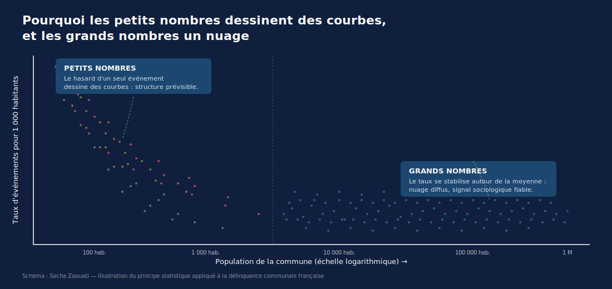

## Le constat

Vieille-Toulouse, Haute-Garonne. 1 230 habitants. 37 cambriolages enregistrés en 2024. Taux : **67,9 ‰**.

C'est le taux le plus élevé de France pour les communes dont le ministère de l'Intérieur publie le chiffre 2024. Si Paris connaissait le même taux, le nombre annuel de cambriolages dans la capitale serait d'environ 95 000. Le chiffre réel est de 9 235.

L'écart entre ces deux chiffres ne vient pas d'une différence de criminalité, mais d'une mécanique mathématique. Cet article la décompose.



## La méthode

```{r setup}
library(duckdb)
library(DBI)
library(dplyr)
library(ggplot2)
library(scales)
library(plotly)
library(htmlwidgets)

con <- dbConnect(duckdb::duckdb(), dbdir = ":memory:")

# Chemins relatifs depuis episodes/01_cambriolages/ vers data/
csv_path <- "../../data/delinquance/donnee-data.gouv-2025-geographie2025-produit-le2026-02-03.csv"

dbExecute(con, sprintf("
  CREATE VIEW delinquance AS
  SELECT * FROM read_csv_auto('%s', delim=';', decimal_separator=',', header=true)
", csv_path))
```

```{r cog}
# Téléchargement (et mise en cache) du Code Officiel Géographique INSEE
# pour récupérer les libellés des communes
cog_url  <- "https://www.insee.fr/fr/statistiques/fichier/8377162/v_commune_2025.csv"
cog_path <- "../../data/referentiels/v_commune_2025.csv"
if (!file.exists(cog_path)) {
  dir.create("../../data/referentiels", recursive = TRUE, showWarnings = FALSE)
  download.file(cog_url, cog_path, mode = "wb")
}

dbExecute(con, sprintf("
  CREATE VIEW cog AS
  SELECT * FROM read_csv_auto('%s', header=true)
", cog_path))
```

```{r data}
# Extraction cambriolages 2024 + jointure avec libellés communes
cambri <- dbGetQuery(con, "
  SELECT
    d.CODGEO_2025 AS code_commune,
    c.LIBELLE     AS nom_commune,
    c.DEP         AS departement,
    CAST(d.insee_pop AS DOUBLE) AS population,
    CAST(d.nombre AS DOUBLE)    AS nb_cambriolages,
    CAST(REPLACE(d.taux_pour_mille, ',', '.') AS DOUBLE) AS taux_pour_mille
  FROM delinquance d
  LEFT JOIN cog c ON d.CODGEO_2025 = c.COM
  WHERE d.indicateur = 'Cambriolages de logement'
    AND d.annee = '2024'
    AND d.est_diffuse = 'diff'
    AND d.insee_pop > 0
")

cat("Communes analysées :", nrow(cambri), "\n")
cat("Population totale couverte :", format(sum(cambri$population), big.mark = " "), "\n")
cat("Cambriolages totaux :", format(sum(cambri$nb_cambriolages), big.mark = " "), "\n")
```

## Le graphique

```{r graphique}
#| fig-width: 10
#| fig-height: 6
#| fig-cap: "Taux de cambriolages 2024 selon la taille de la commune. Chaque point = une commune."

ggplot(cambri, aes(x = population, y = taux_pour_mille)) +
  geom_point(alpha = 0.15, size = 0.5, color = "#4A9EBD") +
  scale_x_log10(
    breaks = c(100, 300, 1000, 10000, 100000),
    labels = c("100", "300", "1 000", "10 000", "100 000")
  ) +
  scale_y_continuous(limits = c(0, quantile(cambri$taux_pour_mille, 0.99, na.rm = TRUE))) +
  geom_vline(xintercept = c(100, 300, 1000, 10000),
             linetype = "dotted", color = "grey50") +
  labs(
    title = "L'empreinte digitale des petits nombres",
    subtitle = "Cambriolages 2024 par commune — la dispersion explose à gauche",
    x = "Population (échelle logarithmique)",
    y = "Cambriolages pour 1 000 habitants",
    caption = "Source : SSMSI / data.gouv.fr • Analyse : Sacha Zaouati"
  ) +
  theme_minimal(base_size = 12)
```

## Le graphique interactif

Survolez n'importe quel point pour voir le nom de la commune, sa population
et son nombre de cambriolages. Filtrez par strate de population avec la
légende.

```{r plotly-interactif}
#| fig-width: 10
#| fig-height: 6.5

# Création de strates de population pour le code couleur et le filtrage
cambri_plot <- cambri |>
  mutate(
    strate = case_when(
      population <    300 ~ "1. < 300 hab. (effet petits nombres maximal)",
      population <  1000 ~ "2. 300 – 1 000 hab.",
      population < 10000 ~ "3. 1 000 – 10 000 hab.",
      population < 100000 ~ "4. 10 000 – 100 000 hab.",
      TRUE ~ "5. > 100 000 hab. (loi des grands nombres)"
    ),
    hover_text = sprintf(
      "<b>%s</b> (%s)<br>Population : %s hab.<br>Cambriolages 2024 : %d<br>Taux : %.1f ‰",
      nom_commune, departement,
      format(population, big.mark = " "),
      as.integer(nb_cambriolages),
      taux_pour_mille
    )
  ) |>
  filter(taux_pour_mille <= quantile(taux_pour_mille, 0.995, na.rm = TRUE))

palette_strates <- c(
  "1. < 300 hab. (effet petits nombres maximal)" = "#FF6B6B",
  "2. 300 – 1 000 hab."                     = "#FFB347",
  "3. 1 000 – 10 000 hab."                  = "#4A9EBD",
  "4. 10 000 – 100 000 hab."                = "#5DADE2",
  "5. > 100 000 hab. (loi des grands nombres)"   = "#1F4E79"
)

p <- plot_ly(
  data = cambri_plot,
  x = ~population,
  y = ~taux_pour_mille,
  type = "scatter",
  mode = "markers",
  color = ~strate,
  colors = palette_strates,
  text = ~hover_text,
  hoverinfo = "text",
  marker = list(size = 5, opacity = 0.55,
                line = list(width = 0))
) |>
  layout(
    title = list(
      text = "<b>L'empreinte digitale des petits nombres</b><br><sup>Cambriolages 2024 par commune — survolez les points pour explorer</sup>",
      x = 0.02, xanchor = "left",
      font = list(family = "Inter, Helvetica", size = 16)
    ),
    xaxis = list(
      title = "Population (échelle logarithmique)",
      type = "log",
      tickvals = c(100, 300, 1000, 10000, 100000, 1000000),
      ticktext = c("100", "300", "1 000", "10 000", "100 000", "1 M"),
      gridcolor = "#E0E0E0"
    ),
    yaxis = list(
      title = "Cambriolages pour 1 000 habitants",
      gridcolor = "#E0E0E0"
    ),
    legend = list(
      orientation = "h",
      x = 0, y = -0.18,
      font = list(size = 10)
    ),
    margin = list(b = 100),
    annotations = list(
      list(
        x = 0.5, y = 1.05, xref = "paper", yref = "paper",
        text = "Source : SSMSI / data.gouv.fr — Analyse : Sacha Zaouati",
        showarrow = FALSE,
        font = list(size = 10, color = "#888")
      )
    )
  )

# Sauvegarde en HTML autonome (à uploader sur GitHub Pages pour iframe Substack)
saveWidget(p, "graphique_interactif_cambriolages.html",
           selfcontained = TRUE,
           title = "L'empreinte digitale des petits nombres")

p
```

## Le palmarès trompeur

```{r palmares-classique}
top10_brut <- cambri |>
  filter(nb_cambriolages > 0) |>
  arrange(desc(taux_pour_mille)) |>
  head(10) |>
  select(nom_commune, departement, population, nb_cambriolages, taux_pour_mille)

knitr::kable(top10_brut,
             digits = 1,
             caption = "Top 10 brut : les communes au plus fort taux de cambriolages 2024.",
             col.names = c("Commune", "Dép.", "Population", "Cambriolages", "‰ habitants"))
```

Les dix communes au taux le plus élevé. **9 sur 10 ont moins de 4 000 habitants.** Boissettes (Seine-et-Marne, 437 habitants) entre dans ce classement avec 7 cambriolages enregistrés dans l'année.

À titre de comparaison, les grandes métropoles n'apparaissent jamais dans ce palmarès brut. Paris : 6,6 ‰. Marseille : 9,6 ‰. Lyon : 7,9 ‰. Lille : 9,5 ‰. Toulouse : 7,5 ‰. Bordeaux : 8,9 ‰. Toutes situées entre 6 et 10 ‰. Aucune ne s'approche du sommet.

## La correction statistique : le vrai classement

```{r palmares-corrige}
top10_corrige <- cambri |>
  filter(population >= 10000) |>
  arrange(desc(taux_pour_mille)) |>
  head(10) |>
  select(nom_commune, departement, population, nb_cambriolages, taux_pour_mille)

knitr::kable(top10_corrige,
             digits = 1,
             caption = "Top 10 corrigé (communes ≥ 10 000 habitants) : un classement informatif.",
             col.names = c("Commune", "Dép.", "Population", "Cambriolages", "‰ habitants"))
```

On retire les communes de moins de 10 000 habitants. Reste : **1 116 communes sur 10 951**. Le seuil n'est pas mathématique. C'est un choix méthodologique inspiré des seuils utilisés dans le secteur sanitaire (300 accouchements par an pour les maternités, 50 interventions pour les centres de chirurgie cardiaque).

Les dix communes au taux le plus élevé parmi les 1 116 retenues. **7 sur 10 sont des banlieues pavillonnaires de métropoles régionales** (Tours, Bordeaux, Rouen, Rennes, Metz). 2 sont en Guyane (Kourou, Saint-Laurent-du-Maroni). Aucune n'apparaît dans le top 10 brut.

## Pourquoi un écart pareil entre les deux palmarès

Trois faits suffisent à le décrire.

### Fait n° 1 — Le ministère masque déjà les plus petites communes

Le SSMSI ne diffuse pas tous les chiffres communaux. Pour préserver la confidentialité, les communes où le nombre de cambriolages est trop faible pour être anonymisable sont masquées (champ `est_diffuse`). **10 951 communes sont diffusées, sur 34 945 communes en France** selon le Code officiel géographique INSEE 2025.

### Fait n° 2 — Le seuil de 10 000 est conventionnel

Il n'existe pas de seuil mathématique « vrai ». Les autorités sanitaires utilisent des seuils de fiabilité du même ordre : 300 accouchements par an minimum pour une maternité, 50 interventions par an pour un centre de chirurgie cardiaque. En dessous, les taux d'échec calculés sur trop peu de cas ne sont plus interprétables individuellement.

### Fait n° 3 — Démonstration par simulation

```{r simulation-poisson}
#| fig-width: 9
#| fig-height: 4.5
#| fig-cap: "Simulation : 1 000 communes IDENTIQUES de 200 logements, même probabilité réelle 5 ‰. La dispersion observée vient uniquement du tirage aléatoire."

set.seed(42)
n_communes <- 1000
n_logements_petit <- 200
p_reel <- 0.005   # 5 ‰, taux moyen national

# Tirage Poisson(λ = n × p) = Poisson(1) pour chaque commune
cambri_simule_petit <- rpois(n_communes, lambda = n_logements_petit * p_reel)
taux_simule_petit  <- cambri_simule_petit / n_logements_petit * 1000

# Statistiques résumées
cat("Communes à 0 cambriolage :", sum(cambri_simule_petit == 0), "\n")
cat("Communes à un taux ≥ 15 ‰ :", sum(taux_simule_petit >= 15), "\n")
cat("Maximum observé :", round(max(taux_simule_petit), 1), "‰\n")
cat("σ théorique = √(p/n) × 1000 =",
    round(sqrt(p_reel / n_logements_petit) * 1000, 2), "‰\n")

ggplot(data.frame(taux = taux_simule_petit), aes(x = taux, y = 1)) +
  geom_jitter(height = 0.3, width = 0, alpha = 0.4, color = "#4A9EBD", size = 1) +
  geom_vline(xintercept = 5, color = "#FF6B6B", linewidth = 0.5) +
  annotate("text", x = 5, y = 1.5,
           label = 'Taux « vrai » identique\npour les 1 000 communes',
           color = "#FF6B6B", hjust = 0, vjust = 0, size = 3) +
  annotate("rect", xmin = 20, xmax = 30, ymin = 0.6, ymax = 1.4,
           fill = "#FF6B6B", alpha = 0.15) +
  annotate("text", x = 25, y = 1.45,
           label = '« Communes les plus dangereuses »',
           color = "#FF6B6B", fontface = "italic", size = 3) +
  scale_x_continuous(breaks = seq(0, 30, 5), limits = c(-1, 31)) +
  labs(
    title = "1 000 communes identiques de 200 logements — voici ce que produit le hasard",
    subtitle = "Tirage de Poisson(λ = 1) — n = 1000",
    x = "Taux observé (‰) — qui ne reflète QUE le hasard",
    y = NULL
  ) +
  theme_minimal(base_size = 11) +
  theme(axis.text.y = element_blank(),
        axis.ticks.y = element_blank(),
        panel.grid.major.y = element_blank(),
        panel.grid.minor.y = element_blank())
```

Paramètres : 1 000 communes simulées, 200 logements chacune, probabilité réelle qu'un logement soit cambriolé fixée à 5 ‰ (moyenne nationale). Pour chaque commune, on tire un nombre de cambriolages selon une loi de Poisson(λ = n × p) = Poisson(1).

Toutes ces communes sont *identiques* en réalité. La dispersion observée vient uniquement du tirage aléatoire.

Si maintenant on refait la même simulation avec 50 000 logements par commune (plutôt que 200), tous les taux observés tombent entre 4,2 et 6,0 ‰. **L'écart-type théorique passe de 5,0 ‰ à 0,32 ‰** entre les deux configurations.

L'écart-type du taux observé décroît en $1/\sqrt{n}$ :

$$\sigma_\text{taux} \approx \sqrt{\frac{p}{n}}$$

Pour Boissettes (n ≈ 200 logements), σ ≈ 5 ‰. Pour Paris (n ≈ 1 400 000 logements), σ ≈ 0,07 ‰. Le rapport est d'environ 70.

## Régression vers la moyenne

Conséquence directe du fait n° 3 : les communes qui apparaissent dans le top brut une année donnée ont une faible probabilité d'y figurer l'année suivante. Sur les 10 communes du top brut 2024, on peut prédire que la majorité aura disparu du top 100 en 2025. Cette prédiction sera vérifiable et vérifiée en mai 2027, à la publication de la base SSMSI 2025.

## Pour aller plus loin

Une [page scrollytelling autonome](scrollytelling/index.html) décompose la même démonstration en dix étapes visuelles, pensées pour la lecture séquentielle (les SVG sont tous régénérables depuis les scripts R dans `scrollytelling/R/`).

Les corrections statistiques pointées par la relecture (formulation explicite de l'hypothèse de communes identiques, mécanisme de la régression vers la moyenne) ainsi que la version *funnel plot* à la Spiegelhalter (2005) et le palmarès *Empirical Bayes* (Robbins 1956 ; Efron 2010) seront ajoutés dans une prochaine itération — voir `Relecture 1.md` (privé) et la roadmap dans `CLAUDE.md`.

## Note méthodologique

**Source.** SSMSI, base communale 2025 publiée en février 2026 sur data.gouv.fr, indicateur « Cambriolages de logement », année 2024. Le taux est calculé pour 1 000 logements, à partir du recensement INSEE.

**Périmètre.** 10 951 communes diffusées sur 34 945 communes françaises (INSEE 2025).

**Simulation.** Tirages indépendants de Poisson(λ = n × p), avec n = nombre de logements, p = 0,005 (taux moyen national). Graine fixée à 42.

**Reproductibilité.** Code (R + Quarto + scripts ggplot2) et données extraites : <https://github.com/sachazaouati/illusion-petits-nombres>. Le `.qmd` est la source canonique ; il génère HTML et PDF via `quarto render` (le rendu PDF requiert TinyTeX, installable depuis Quarto avec `quarto install tinytex`). Code MIT, articles et graphiques CC BY 4.0.

```{r exports, include=FALSE}
# Exports CSV pour Datawrapper et publication GitHub
write.csv(cambri,        "cambriolages_2024.csv", row.names = FALSE)
write.csv(top10_brut,    "top10_brut.csv",        row.names = FALSE)
write.csv(top10_corrige, "top10_corrige.csv",     row.names = FALSE)
```

```{r cleanup, include=FALSE}
dbDisconnect(con, shutdown = TRUE)
```
